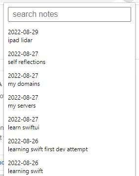

Add eye icon to the iframe so you can toggle its transparency.

Also a draggable handle to move it.

#### Monday 08/29/2022

I'm going to modify the CPA API to show recently modified notes and ability to expand them.

Then pull that API output into this chrome extension

Hopefully I can do it I'm pretty spent

Then I have to go back to working with Swift

10:20 PM

I gotta figure out what variant of an API the CPA one is, I built it a while back

Variant as in changes on prod that I did that's not in the repo

Crap thing isn't on a repo, using systemd to run

Finally using grep, systemd file in a weird place, have to remember how to restart deamon

Oof... I don't think the name column is indexed damn... that query took a long time.

No it is indexed... hmm

11:11 PM

took me a bit but found a query that works

https://stackoverflow.com/questions/11937206/sql-query-multiple-columns-using-distinct-on-one-column-only

11:22 PM

cool, now I just gotta add a basic collapsible thing

#### Sunday 08/28/2022

Well... I feel like I went in circles.

I am still not sure if I'm safe (lol)

But this method vs. the other branch is way easier/less stuff to deal with.

And I don't have to worry about logging/persisting a token/shortcode.

I'll do some more research... I'm just trying to proactively protect myself from complacency.

Imagine using this thing for years and you realize it was hijacked and the data is being piped into somewhere.

Of course who cares... like it's rare. Your entire OS is compromised lol.

I'll improve this over time.

I forgot that the NANTA chrome extension is buggy, I'll have to fix that/improve it and... actually add the reminder part that I wanted

I'm gonna have to rework this... I got the concept down, it's nasty, I screwed up all the styling and what not ugh